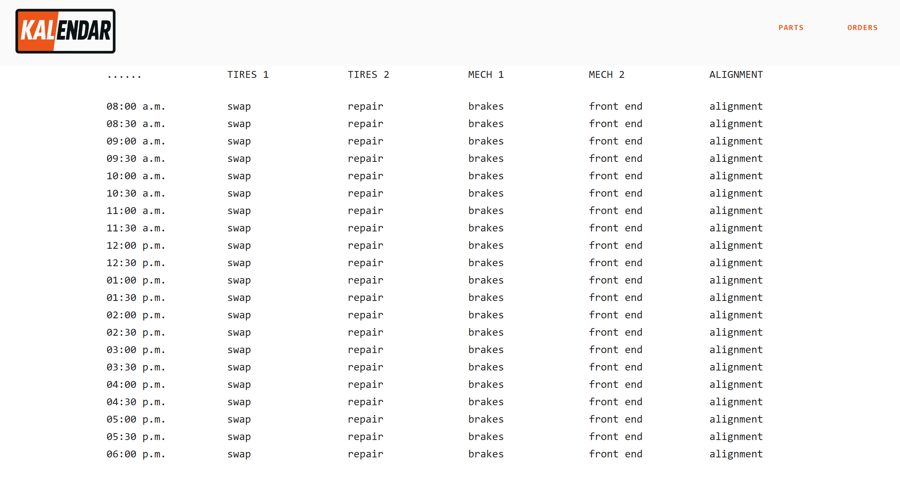

<h1 style="font-family:monospace">Kalendar</h1>
<div style="padding-bottom:20px">
    
    
    
    
</div>

<p style="font-family:monospace">Auto shop appointment scheduler (in progress)</p>




<h2 style="font-family:monospace">Installation</h2>

```bash
# clone project
git clone https://www.github.com/ttamre/kalendar.git
cd kalendar

# install python dependencies
python3 -m venv venv
source venv/bin/activate
pip install -r requirements.txt

# install node dependencies
cd ../frontend
npm install
```

<h2 style="font-family:monospace">Usage</h2>

<h3 style="font-family:monospace">development</h3>

```bash
# use 2 terminal windows so you can see all logs and linting errors

# backend (terminal 1, with venv active)
cd backend
uvicorn api:api --reload --port 5000

# frontend (terminal 2)
cd frontend
npm start
```

<h3 style="font-family:monospace">production</h3>

```bash
# run node in background
cd frontend
npm run build
serve -s build &

# run api in foreground
cd ../backend
source ../venv/bin/activate
uvicorn api:api --port 5000
```
